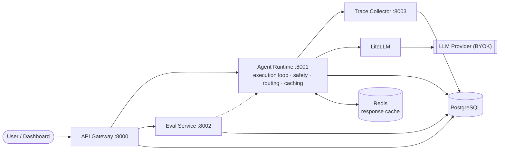

# AgentForge

**Agent-native AI platform** — build, deploy, evaluate, monitor, and govern autonomous AI agents. Think "Vercel for AI agents": a production platform for teams that define agents, push them live, run evaluations, track costs, and enforce safety policies, instead of another LLM chatbot wrapper.

> Full project context lives in [CLAUDE.md](CLAUDE.md), system design in [ARCHITECTURE.md](ARCHITECTURE.md) and [docs/diagrams/](docs/diagrams/), and the build plan in [MILESTONES.md](MILESTONES.md).

## What makes it agent-native

Most LLM-ops tools (LangSmith, Humanloop) log request/response pairs. AgentForge is built for **autonomous agents** that run multi-step reasoning loops, call external tools, branch on results, and must follow safety and governance rules — so the platform traces the whole run, not just the API call. A single agent invocation produces a full timeline: LLM call → tool call → LLM call, each step timed and token-counted, viewable end to end. See [`docs/diagrams/request-flow.md`](docs/diagrams/request-flow.md) for the real sequence.

## Architecture at a glance



Six core components: **Python SDK**, **API Gateway** (FastAPI), **Agent Runtime** (execution loop + safety enforcement), **Token Optimization Layer** (LiteLLM + optional LLMLingua), **Evaluation Pipeline**, and the **Observability Stack** (OpenTelemetry + Prometheus + Grafana), fronted by a React **Dashboard**. Full diagram set (system architecture, request sequence, data model ER diagram) in [`docs/diagrams/`](docs/diagrams/).

## Tech stack

Python 3.11+ / FastAPI · PostgreSQL · Redis · Docker Compose (local) / Kubernetes via Helm (prod) · LiteLLM · OpenTelemetry / Prometheus / Grafana · React + TypeScript + Tailwind · Terraform (AWS/EKS).

## Project structure

```
agentforge/
├── services/           # api-gateway, agent-runtime, eval-service, trace-collector (FastAPI)
├── packages/
│   ├── sdk/             # agentforge — the Python SDK
│   └── common/           # agentforge_common — shared models/utils
├── dashboard/           # React + TS + Tailwind UI
├── infra/
│   ├── docker/           # docker-compose.yml + per-service Dockerfiles
│   ├── terraform/         # AWS infra as code (VPC, EKS, RDS, ElastiCache, ECR, S3)
│   └── helm/              # Kubernetes chart (all 5 services, data-driven)
├── .github/workflows/   # CI (lint/test/build) + CD (GHCR always-on, ECR+EKS opt-in)
├── tests/               # unit, integration
├── docs/                # diagrams, API docs, benchmarks, security, demo script
└── scripts/             # dev seed, benchmark, teardown
```

## Local development

Requires [Docker](https://www.docker.com/) and [uv](https://docs.astral.sh/uv/).

```bash
cp .env.example .env          # add your OpenAI API key
docker compose -f infra/docker/docker-compose.yml --env-file .env up -d
uv run python scripts/seed.py # prints a dev API key + seeds sample agents/runs/evals
```

Services then available at:

| Service | URL |
|---|---|
| Dashboard | http://localhost:3001 |
| API Gateway | http://localhost:8000 (docs at `/docs`) |
| Agent Runtime | http://localhost:8001 *(internal)* |
| Eval Service | http://localhost:8002 *(internal)* |
| Trace Collector | http://localhost:8003 *(internal)* |
| Grafana | http://localhost:3000 (admin/agentforge) |
| Prometheus | http://localhost:9090 |

Check everything is up:

```bash
curl localhost:8000/health && curl localhost:8001/health && curl localhost:8002/health && curl localhost:8003/health
```

Each should return `{"status": "ok"}`.

### Try it

```bash
export KEY=afk_...   # from scripts/seed.py's output
curl -H "X-API-Key: $KEY" http://localhost:8000/api/v1/agents | python -m json.tool
```

Full API reference with real example payloads: [`docs/api/README.md`](docs/api/README.md).
Want a guided walkthrough instead? [`docs/demo-script.md`](docs/demo-script.md).

### Running a service without Docker

```bash
uv sync --package api-gateway
cd services/api-gateway
uv run --project ../.. uvicorn main:app --reload --port 8000
```

## What it actually does (verified, not aspirational)

Every milestone below was verified against the live stack, not just unit-tested — see [`MILESTONES.md`](MILESTONES.md) for the full bug-by-bug account of what verification caught that code review alone wouldn't have.

- **Agent execution**: a full think→act→observe loop with tool calling, real cost tracking, and configurable timeouts/iteration caps.
- **Safety enforcement**: PII detection + keyword blocking, checked in-process before every tool call and after every LLM response — not a prompt-level instruction a model could talk its way around.
- **Tracing**: OpenTelemetry spans for every LLM call, tool call, and safety check, queryable per-run and visualized in the Trace Viewer.
- **Evaluation**: test suites scored by LLM-as-judge + tool-call correctness, with version-to-version comparison.
- **Token optimization**: smart model routing, Redis-backed response caching (measured **~13x latency speedup, 100% cost reduction** on cache hits — see [`docs/benchmarks.md`](docs/benchmarks.md)), optional prompt compression, and per-agent daily budget enforcement.
- **Dashboard**: all 6 pages (catalog, detail, trace viewer, evals, cost analytics, settings) browser-verified against live seeded data.
- **Infrastructure**: Terraform (VPC/EKS/RDS/ElastiCache/ECR/S3) + a data-driven Helm chart, both validated (`helm lint`/`helm template` across 3 environments, every Docker image actually built) — not required to run the platform (Docker Compose is $0, see [ADR-003](CLAUDE.md#adr-003-docker-compose-for-dev-k8s-for-prod)), but real and deployable. Cost breakdown: [`docs/aws-cost-estimate.md`](docs/aws-cost-estimate.md).

## Docs

| Doc | What's in it |
|---|---|
| [`ARCHITECTURE.md`](ARCHITECTURE.md) | Original system design |
| [`docs/diagrams/`](docs/diagrams/) | Architecture, request-flow, and data-model diagrams (Mermaid) |
| [`docs/api/README.md`](docs/api/README.md) | API reference with real example requests/responses |
| [`docs/benchmarks.md`](docs/benchmarks.md) | Real latency/cost numbers from the live stack |
| [`docs/security.md`](docs/security.md) | Auth model, safety enforcement, and an honest gap list |
| [`docs/aws-cost-estimate.md`](docs/aws-cost-estimate.md) | What the Terraform config would actually cost, per environment |
| [`docs/demo-script.md`](docs/demo-script.md) | A 5-minute guided walkthrough |
| [`docs/interview-talking-points.md`](docs/interview-talking-points.md) | Design decisions and tradeoffs worth discussing |
| [`MILESTONES.md`](MILESTONES.md) | The full build log — what shipped, what broke, what fixed it |
| [`CONTRIBUTING.md`](CONTRIBUTING.md) | Dev setup, conventions, how to add a service |

## Status

All 10 planned milestones complete — see [`MILESTONES.md`](MILESTONES.md) for the full build history.

## License

TBD.
