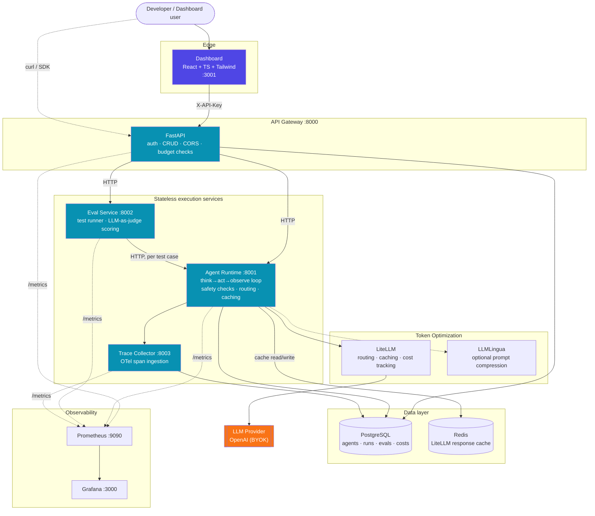

# System Architecture

**Service boundary rule**: only the API Gateway is reachable from outside the
cluster (plus the Dashboard, which itself only talks to the Gateway). Agent
Runtime, Eval Service, and Trace Collector are internal-only and stateless —
all persistence goes through Postgres, all inter-service calls are plain HTTP.
This is the same boundary enforced in `infra/helm/agentforge/values.yaml`
(only `api-gateway` and `dashboard` get an `ingressPath`).
