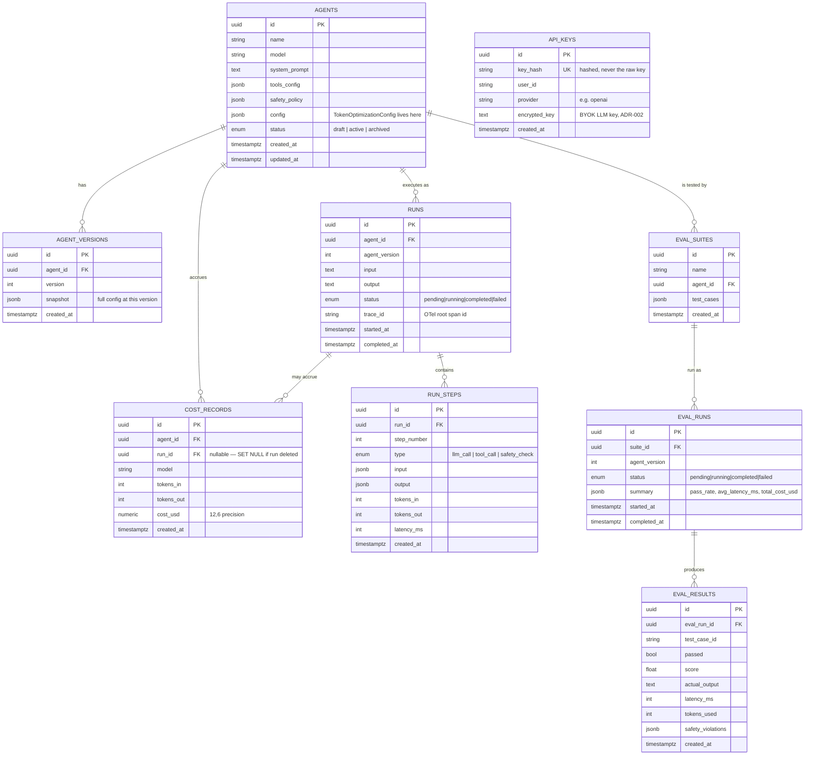

# Data Model

Matches `packages/common/agentforge_common/orm.py` exactly — 9 tables, all
Postgres, all owned by the API Gateway (Agent Runtime, Eval Service, and
Trace Collector are stateless and never write directly to these tables).

**Notable design choices:**
- `AGENTS.config` and `AGENTS.safety_policy` are JSONB, not normalized tables
  — both are small, always read/written as a whole unit with the agent, and
  change shape between milestones (e.g. `TokenOptimizationConfig` was added
  in Milestone 7 with zero migrations, since it just lives inside existing
  JSONB).
- `RUN_STEPS.type` is a single enum covering three very different kinds of
  step (LLM call, tool call, safety check) rather than three separate tables
  — the Trace Viewer needs to render them as one ordered timeline anyway, and
  a shared `input`/`output` JSONB shape is flexible enough for all three.
- `COST_RECORDS.run_id` is nullable with `ON DELETE SET NULL` — a cost record
  survives its originating run being deleted, since spend history shouldn't
  disappear with the run that generated it.
