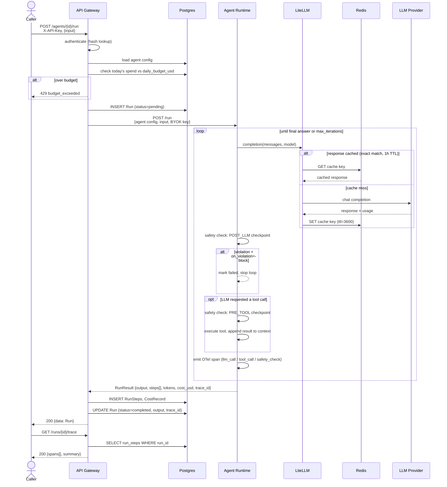

# Request Flow: `POST /api/v1/agents/{id}/run`

One agent run, from the API call to the persisted trace. Matches the real
control flow in `services/api-gateway/routers/runs.py` and
`services/agent-runtime/engine.py`.

Cache hits (per Milestone 7) are forced to `cost_usd = 0.0` — a cache-served
response still reports token counts for observability, but doesn't count
against the agent's daily budget.
